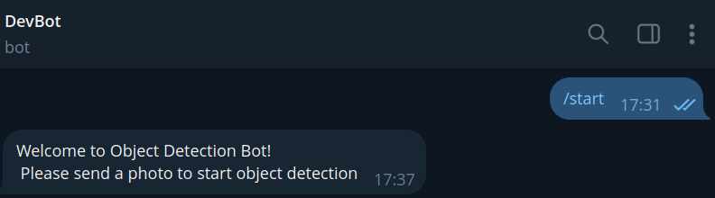
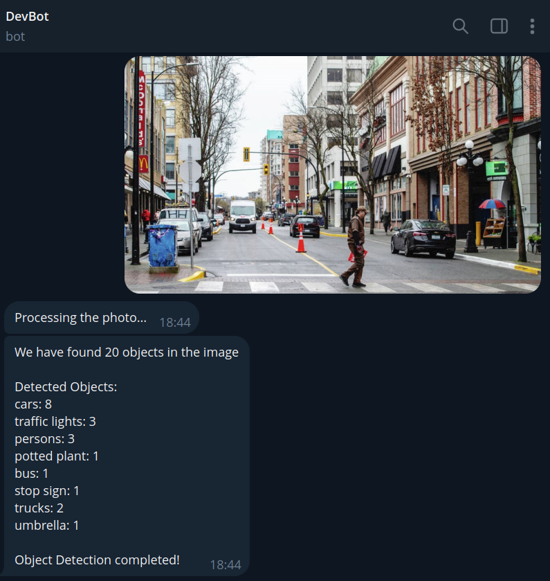

# Polybot Service: Docker Project

## Description

Polybot Service is a Telegram bot that allows users to run object detection process on photos using yolo5 pre-train deep learning model.

## Table of Contents

- [Features](#features)

- [Prerequisites](#Prerequisites)

- [Installation](#Installation)

- [Usage](#Usage)

- [Contributing](#contributing)

- [License](#license)

## Features

- Object Detection on Photos: Users can send photo to bot and get how many objects in the photo and the name of the objects.
- Fast Object Detection: the user will get object detection result in seconds and explained.
- Data storing persistently: the bot will store the data of the user and the photo in the database.

## Prerequisites

Before running the polybot service, make sure you have the following prerequisites installed:

- Git: You need to have Git installed on your system to clone the repository. You can download it from the official Git website: https://git-scm.com/downloads/
- Docker: You need to have Docker installed on your system. You can install it from the official Docker website: https://docs.docker.com/engine/install/ubuntu/

Once you have installed these prerequisites, you can proceed with the steps mentioned in the "Getting Started" section to run the library manager program.


## Installation

1. Clone the repository:

   ```shell
   git clone https://github.com/MohammadKhGh99/PolybotServiceDockerFursa.git
   ```
2. Run the polybot service:

   ```shell
   docker compose up -d
   ```

## Usage

1. Start a chat with the bot on Telegram.

2. Send a photo to the bot, and let the magic happen!


## Contributing

Contributions are welcome! If you have any ideas, suggestions, or bug reports, please open an issue or submit a pull request.

## License
This project is licensed under the MIT License - see the [LICENSE](LICENSE) file for details.